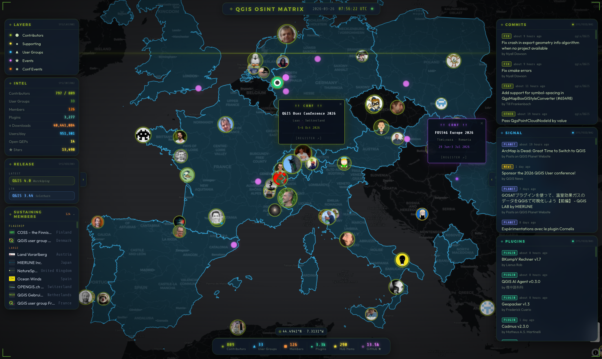

# QGIS OSINT Matrix

```
  ██████╗  ██████╗ ██╗███████╗      ██████╗ ███████╗██╗███╗   ██╗████████╗
 ██╔═══██╗██╔════╝ ██║██╔════╝     ██╔═══██╗██╔════╝██║████╗  ██║╚══██╔══╝
 ██║   ██║██║  ███╗██║███████╗     ██║   ██║███████╗██║██╔██╗ ██║   ██║
 ██║▄▄ ██║██║   ██║██║╚════██║     ██║   ██║╚════██║██║██║╚██╗██║   ██║
 ╚██████╔╝╚██████╔╝██║███████║     ╚██████╔╝███████║██║██║ ╚████║   ██║
  ╚══▀▀═╝  ╚═════╝ ╚═╝╚══════╝      ╚═════╝ ╚══════╝╚═╝╚═╝  ╚═══╝   ╚═╝
```

> A real-time geospatial intelligence dashboard for the QGIS ecosystem.

[](LICENSE)
[](https://kit.svelte.dev)
[](https://fastapi.tiangolo.com)
[](https://maplibre.org)
[](https://docs.docker.com/compose/)




---

## What it is

QGIS OSINT Matrix visualises data from the public QGIS ecosystem on a full-screen WebGL map with glassmorphism HUD panels, live feed tracks, and a boot sequence animation. All ingested data is already public — no private data is collected or displayed.

**Layers on the map**
- Contributors (commit-tier sized avatars; higher commit count renders on top)
- Supporting contributors (avatar markers from `supporting_map.json`)
- User groups (country polygons)
- Past and Upcoming Events

**Sustaining members panel**
- Collapsible side panel listing of sustaining members (organisations) grouped by tier (Flagship / Large / Medium / Small) — not shown on the map

**Live feed channels**
- GitHub commits, releases, QEPs
- QGIS News, Blog, Planet aggregator
- Plugin repository, QGIS Hub resources

---

## Quick start

### Using Docker

```bash
cp .env.example .env
docker compose up -d    # proxy + frontend + backend + db + cache
```

The app is available at `http://localhost` (Caddy handles TLS termination).

> NOTE: The data should be fetched on start, refresh after a while if it's still empty.

### Using Nix

```bash
cp .env.example .env    # fill in GITHUB_TOKEN at minimum (Optional)
nix develop             # enter the reproducible dev shell
just dev                # starts Postgres + Redis + backend + frontend
```

Then open **http://localhost:5173** in your browser.

| URL | What's there |
|-----|--------------|
| http://localhost:5173 | Frontend (Vite dev server, hot-reload) |
| http://localhost:8000 | Backend API |
| http://localhost:8000/docs | Interactive API docs (Swagger UI) |

On first run `just dev` initialises the Postgres data directory, runs Alembic migrations, and fires all data workers immediately — the map populates within seconds.

> NOTE: The data should be fetched on start, refresh after a while if it's still empty.

---

## Development

### Nix (recommended)

A [Nix flake](https://nixos.wiki/wiki/Flakes) ships a fully-reproducible dev shell with Python 3.13, Node 22, and all tooling pre-installed — no manual `pip install`, `nvm`, or Docker required for development.

```bash
# One-time: enable flakes if you haven't already
# echo 'experimental-features = nix-command flakes' >> ~/.config/nix/nix.conf

nix develop    # enter the dev shell (first run downloads ~500 MB, cached after)
just dev       # start everything: Postgres + Redis + FastAPI + Vite
```

Open **http://localhost:5173** — the map loads automatically.

`just dev` launches [process-compose](https://github.com/F1bonacc1/process-compose) which manages all four processes with health-checked startup ordering:

```
postgres ──► postgres-init ──► backend  (http://localhost:8000)
redis    ──►                   backend
                               frontend (http://localhost:5173)
```

All state lives in `.dev-data/` (gitignored). Delete that directory to start with a clean database.

**Other `just` recipes:**

```bash
just dev-logs        # headless mode — raw logs streamed to stdout (good for tmux)
just migrate         # run alembic upgrade head only
just backend         # migrate + uvicorn --reload (without process-compose)
just frontend        # npm install + vite dev server only
just up              # start only db + redis via Docker
```

### Manual

Requires PostgreSQL 16 + PostGIS, Redis, Python 3.13, and Node 22 installed locally.

```bash
# Start Postgres and Redis however you prefer, then:

# Backend
cd backend
python -m venv .venv && source .venv/bin/activate
pip install -r requirements.txt
alembic upgrade head
uvicorn app.main:app --reload   # http://localhost:8000

# Frontend (separate terminal)
cd frontend
npm install
npm run dev                     # http://localhost:5173
```

The Vite dev server proxies `/api` → `http://localhost:8000`.

---

## Tech stack

| Layer      | Technology                                      |
|------------|-------------------------------------------------|
| Frontend   | SvelteKit 2 · Svelte 5 · MapLibre GL JS 5      |
| Backend    | FastAPI 0.115 · APScheduler · SQLAlchemy 2      |
| Database   | PostgreSQL 16 + PostGIS · Alembic migrations    |
| Cache / SSE| Redis 7 (pub/sub fan-out for SSE)               |
| Proxy      | Caddy 2 (TLS termination, SSE passthrough)      |
| Container  | Docker Compose (5 services)                     |

---

## Project structure

```
├── backend/            FastAPI application
│   ├── app/
│   │   ├── api/v1/     REST endpoints (proxy, layers, feeds, stats, stream)
│   │   ├── core/       config, db, redis
│   │   ├── models/     SQLAlchemy models
│   │   ├── workers/    APScheduler jobs (github, rss, plugins, hub, analytics…)
│   │   └── cli.py      Typer CLI (refresh-feeds, refresh-layers)
│   └── migrations/     Alembic (PostGIS schema)
├── frontend/           SvelteKit application
│   └── src/
│       ├── lib/
│       │   ├── components/   HUD panels, feed tracks, map popups
│       │   ├── map/          MapLibre sources, layers, popup builders
│       │   ├── stores/       Svelte stores (layers, feeds, stats, SSE, notifications)
│       │   └── utils/        Formatting helpers, colour constants
│       └── routes/
├── data/
│   └── countries_polygon.geojson   Natural Earth country polygons — user-group layer
├── docker/             Caddyfile, nginx.conf, frontend.Dockerfile
├── docker-compose.yml
└── PLAN.md             Full specification and roadmap
```

---

## Data sources

All data is fetched from public endpoints — no authentication required unless noted.

| # | Data | Exact URL | Notes |
|---|------|-----------|-------|
| 1 | Contributors GeoJSON | `https://www.qgis.org/data/contributors/contributors_map.json` | GitHub Actions–generated, fallback: raw.githubusercontent.com |
| 2 | Supporting contributors GeoJSON | `https://www.qgis.org/data/contributors/supporting_map.json` | Same pipeline |
| 3 | Sustaining members (JSON API) | `https://members.qgis.org/en/members/json/` | Harvested daily by scraper; served at `/api/v1/layers/members` for the sustaining members panel |
| 4 | QGIS version info | `https://version.qgis.org/version.json` | `latest` = current, `ltr` = long-term release |
| 5 | Plugin repository (latest) | `https://plugins.qgis.org/plugins/latest/?sort=latest_version_date&order=desc&per_page=50` | HTML page scraped with stdlib `HTMLParser` (no public JSON/XML API for the latest-updated view); returns the 50 most recently updated plugins |
| 6 | QGIS News feed | `https://feed.qgis.org/?json=1` | JSON endpoint |
| 7 | QGIS Blog | `https://blog.qgis.org/feed/` | WordPress RSS |
| 8 | Planet QGIS | `https://planet.qgis.org/posts/index.xml` | Community blog aggregator |
| 9 | GitHub commits — QGIS core | `https://api.github.com/repos/qgis/QGIS/commits` | `GITHUB_TOKEN` recommended |
| 10 | GitHub commits — Website | `https://api.github.com/repos/qgis/QGIS-Website/commits` | |
| 11 | GitHub commits — Docs | `https://api.github.com/repos/qgis/QGIS-Documentation/commits` | |
| 12 | GitHub repo stats | `https://api.github.com/repos/qgis/QGIS` | Stars, forks, open issues |
| 13 | Open QEPs | `https://api.github.com/repos/qgis/QGIS-Enhancement-Proposals/issues?state=open` | |
| 14 | Matomo download analytics | `https://matomo.qgis.org/index.php?module=API&method=UserCountry.getCountry&period=month&date=today&format=JSON&token_auth=anonymous&idSite=1` | Anonymous public API |
| 15 | Events / Hackfests | `https://raw.githubusercontent.com/qgis/QGIS/master/resources/data/qgis-hackfests.json` | Official GeoJSON with coordinates; 28 hackfest locations |
| 16 | User groups | `https://raw.githubusercontent.com/qgis/QGIS/master/resources/data/user_groups_data.json` | Official JSON (no geometry); joined with local `data/countries_polygon.geojson` (iso_a2) to render country polygons |
| 17 | QGIS Hub API | `https://hub.qgis.org/api/v1/resources/?limit=20` | Latest 20 published resources (styles, models, geopackages, 3D objects) for the hub feed; `?limit=1` used for total-resource count |
| 18 | Metabase — plugins.qgis.org | `https://plugins.qgis.org/metabase/api/public/dashboard/7ecd345f-…` | Public dashboard cards: plugin count time-series and all-time download total; no auth token required |
| 19 | Metabase — feed.qgis.org | `https://feed.qgis.org/metabase/api/public/dashboard/df81071d-…` | Public dashboard cards: QGIS opens last 30 days and opens yesterday |
| 20 | Metabase — hub.qgis.org | `https://hub.qgis.org/metabase/api/public/dashboard/7ecd345f-…` | Public dashboard cards: published counts by resource type (styles, models, geopackages, 3D objects) |


---

## License

[GNU General Public License v2.0](LICENSE) — consistent with the QGIS project license.

---

*Built with ❤️ for the QGIS community.*
